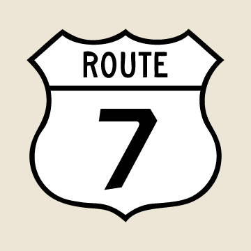
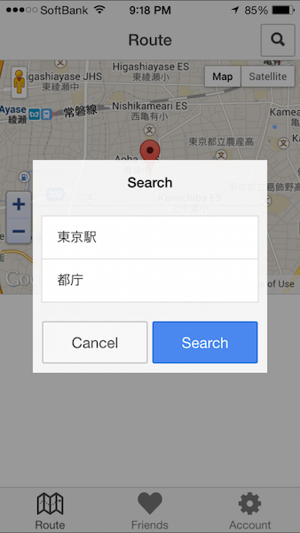
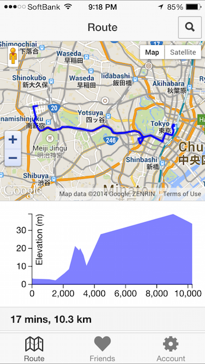

# Route7



Ionic を使った Cordova アプリです。ひとまず、ルート検索結果の標高を表示します。





## Setup

Install tools.

```
npm install -g cordova
npm install -g ionic
npm install -g ios-sim
```

Install dependencies.

```
npm install
bower install
```

Add platform.

```
ionic platform add ios
```

Add plugins.

```
ionic plugin add com.ionic.keyboard
ionic plugin add org.apache.cordova.device
ionic plugin add org.apache.cordova.console
ionic plugin add org.apache.cordova.geolocation
```

## Development

Preview in browser with livereload.

```
ionic serve
```

Test in emulator.

```
# List available emulators.
./platforms/ios/cordova/lib/list-emulator-images

ionic build ios
ionic emulate ios --target="iPhone (Retina 4-inch)"
```

Test in device.

```
ionic run ios
```
